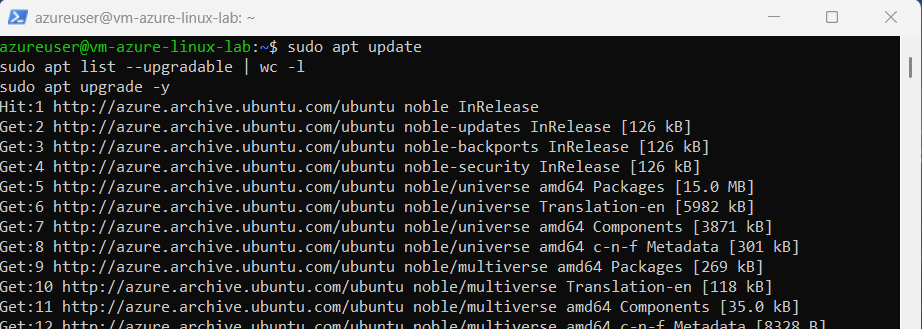
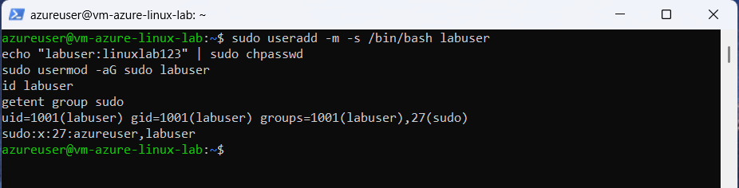
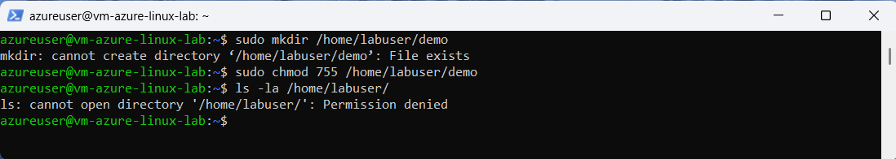

# 02: Linux Fundamentals - Ubuntu 24.04

## System Baseline

## Package Updates
sudo apt update && sudo apt upgrade -y

## User & Permissions Management
**Create labuser + sudo:**

sudo useradd -m -s /bin/bash labuser
echo "labuser:linuxlab123" | sudo chpasswd
sudo usermod -aG sudo labuser

**Isolation Demo:**

## Skills Demonstrated
- System inspection (`lsb_release`, `df`, `free`)
- Apt lifecycle (update/upgrade)
- User provisioning, sudo groups
- Filesystem isolation/permissions
