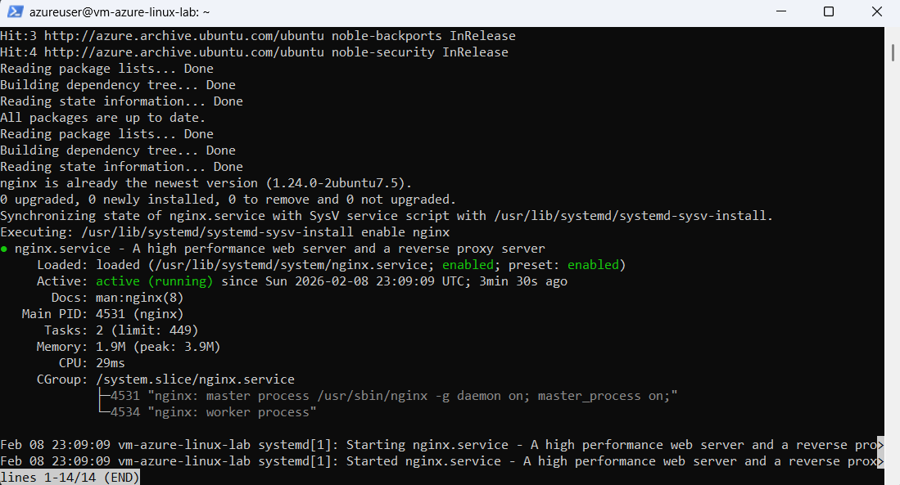
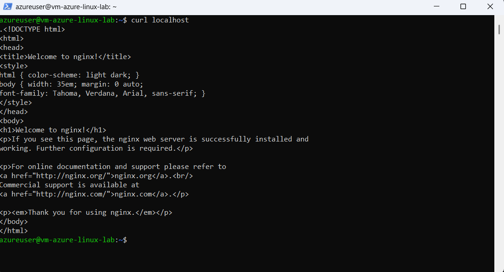
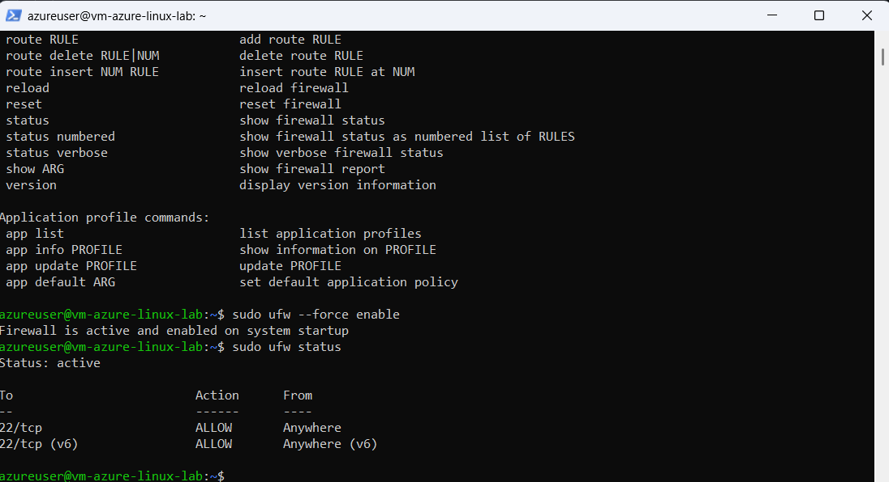
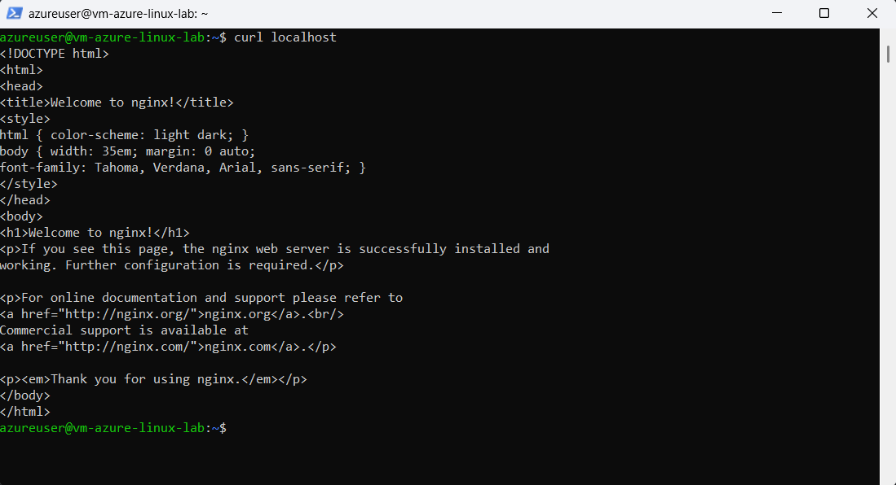

# 03: Web Services + Firewall - Nginx + UFW

## What is Nginx?
**Nginx** ("engine-x") is a free, open-source **web server** that delivers HTML pages/websites. [web:79][web:81]  
- **Why use it?** High-performance, low memory (vs Apache), handles 1000s concurrent requests.  
- **Common roles:** Static websites, reverse proxy, load balancer.  
- **Here:** Demo service management + local-only access. [web:83][web:86]

## What is UFW?
**UFW** (Uncomplicated Firewall) is Ubuntu's simple firewall frontend. [web:90]  
- Blocks/allows traffic by port/protocol/IP.  
- Default: **Deny all incoming** (secure).  
- **Here:** Lock nginx to localhost (no external web access).

## Step-by-Step Demo

### 1. Install & Start Nginx
sudo apt update
sudo apt install nginx -y # Package install
sudo systemctl enable nginx # Auto-start on boot
sudo systemctl start nginx # Run now
sudo systemctl status nginx # Verify "active (running)"

**What happened:** Nginx now serves a "Welcome" page on port 80 **internally**.

### 2. Test Locally
curl localhost

Returns nginx default HTML page.  

### 3. Harden with UFW Firewall
sudo ufw allow ssh # Keep SSH open
sudo ufw deny 80 # Block external HTTP
sudo ufw --force enable # Activate (overrides running services)
sudo ufw status verbose

**Result:** Port 80 **DENIED** from internet (security!). SSH (22) allowed.

### 4. Verify Isolation
curl localhost # Local: ✅ Works

**Browser test:** http://48.192.9.212 → **Timeout** (blocked externally).  

## Key Skills Shown
- **systemd:** Service install/enable/start/status [web:68]
- **UFW:** Default-deny policy, port rules, `--force enable`
- **Principle of least privilege:** Local service, external block
- **Verification:** `curl`, `ufw status`, browser test

**Production note:** For real websites, configure `ufw allow 80` + domain/SSL.
